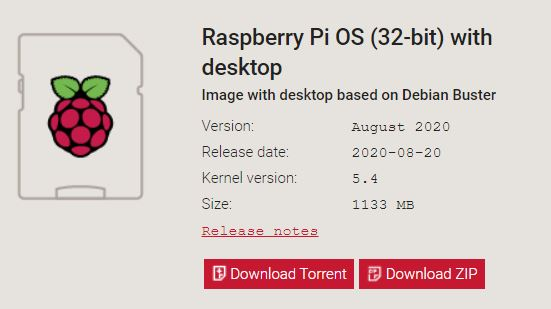
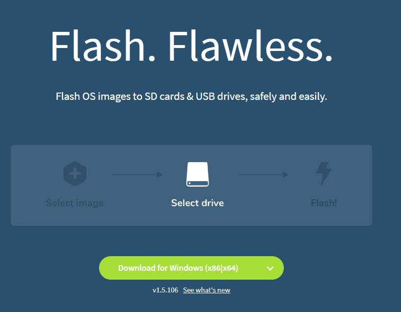
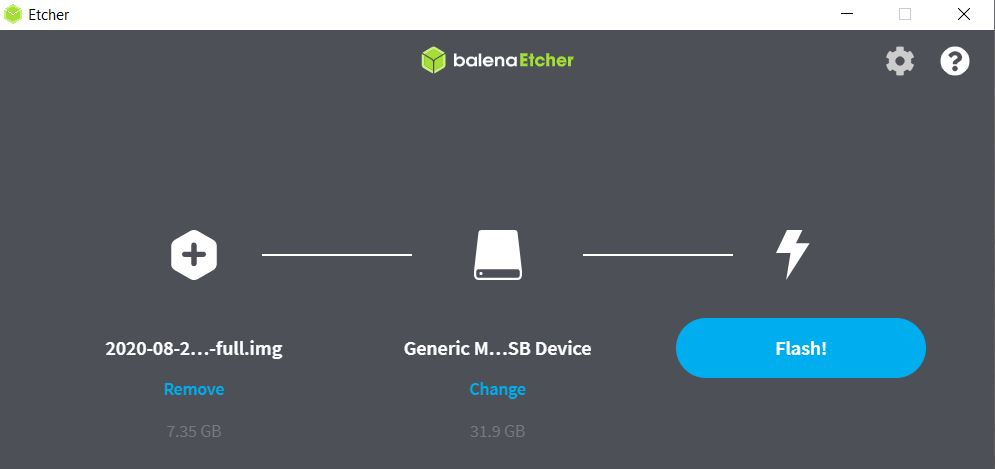
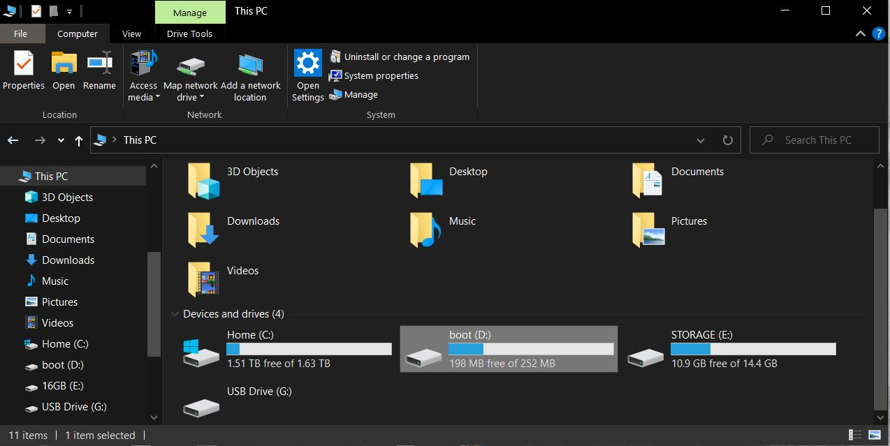
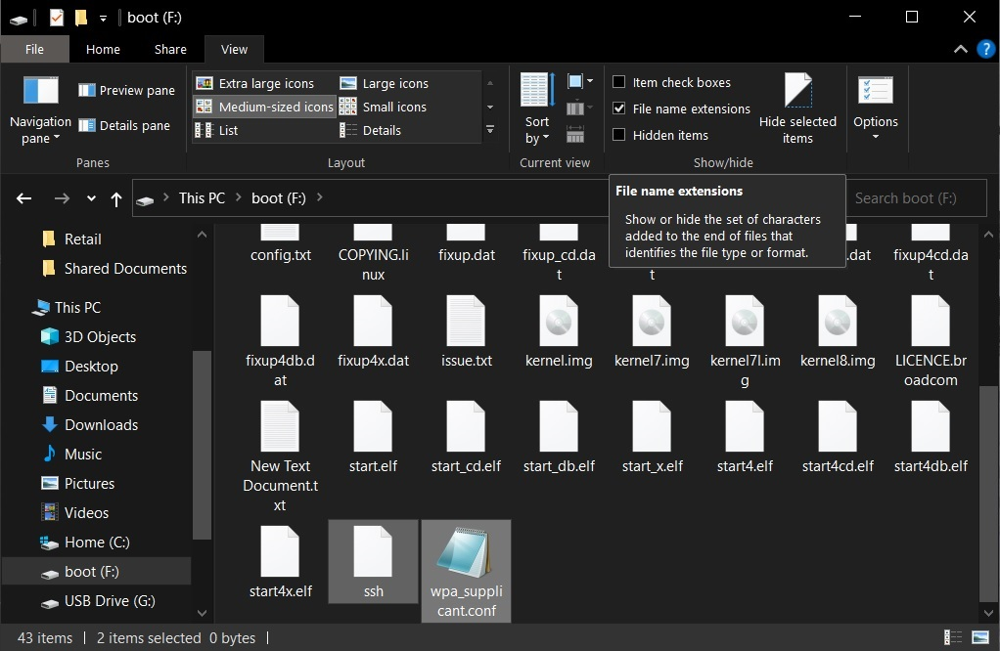
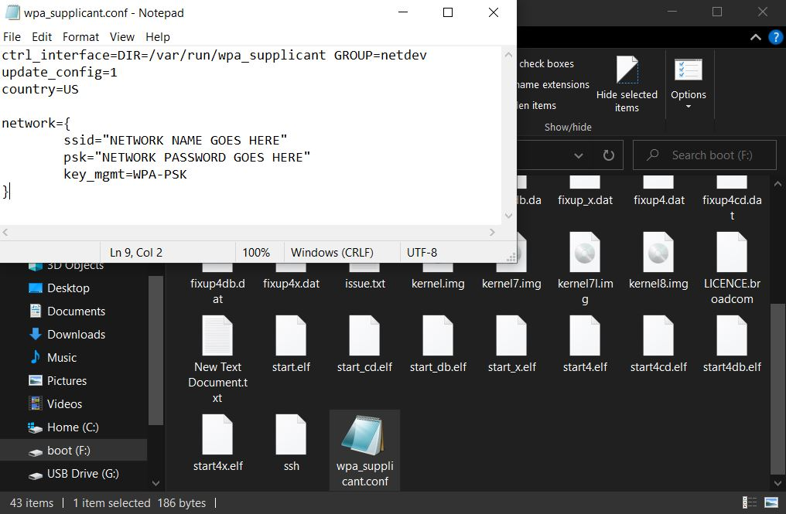
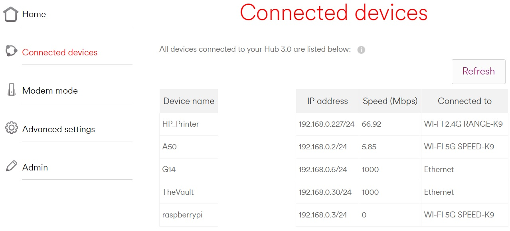
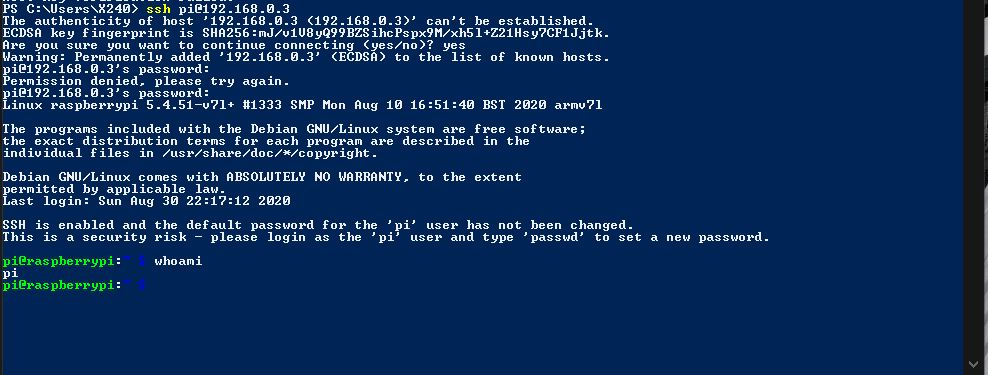
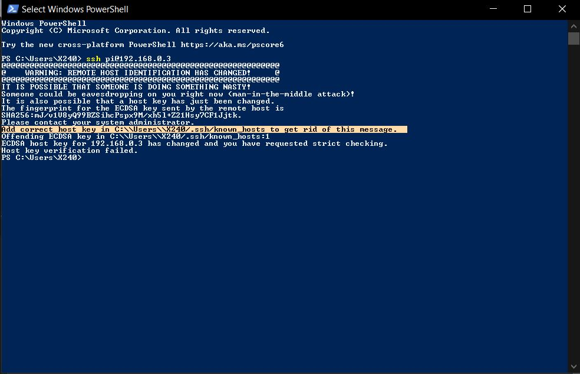
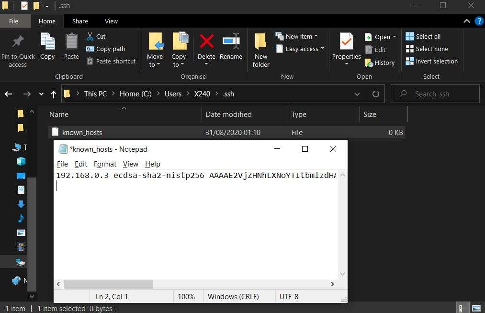

## Raspberry Pi 4 in Headless mode


### Requirements
Besides the Raspberry Pi, you will also need;
- MicroSD Card (8GB or more)
- A copy of RaspberryPiOS.img 
- A copy of Balena Etcher (To flash the RaspberryPiOS.img to the MicroSD Card)
- A wireless network (Router broadcasting wireless internet)

### Recommendations
- Ensure you are using a reliable MicroSD Card. This guide uses a 32GB SanDisk Ultra 10mbps card.
- If your PC does not come with a MicroSD Card slot, use a MicroSD Card adapter or USB to MicroSD.

### Step 1: Download Etcher and Raspberry Pi OS
If you have not done so already here are the links:
- [Balena Etcher](https://www.balena.io/etcher/)
- [Raspberry Pi OS](https://www.raspberrypi.org/downloads/raspberry-pi-os/)

I recommend downloading the "RaspberryPiOS_with_Desktop_Debian_Buster" image.




### Step 2: Flashing the MicroSD Card
1. Once you have insered the MicroSD Card, launch Balena Etcher and select the Raspberry Pi OS as the file to flash from.
2. Select the Target device where you want Etcher to flash the image file to. Select your MicroSD Card.
3. Begin the flashing process.


### Step 3: Create 2 files in the `Boot:/` Directory 
Once the flashing is complete, remove the card from your computer and reinsert back. A message may appear and prompt you to Format the card. **DO NOT** format the card because it will erase the Raspberry OS.
1. **OPTIONAL** You can navigate to File Explorer Ribbon Toolbar and enable "File name extensions". This will reveal all file extension types for every file on your system.
2. Open the BOOT Partition in File Explorer and create two Text Documents. 
   - Name the first text file `ssh` with no file extensions
   - Name the second text file `wpa.supplicant.conf` (make sure `.conf` extension is included otherwise the Raspberry Pi will not read the file)

We need the `ssh` file because we will be using the ssh protocol to connect to our Pi using PowerShell. 

We also need the `wpa` file because we will be connecting the Pi to our wireless network.




### Step 4: Setting up wireless for the Pi 
1. Open the `wpa.supplicant.conf` file in Notepad and copy/paste and save this code in the file.
```
ctrl_interface=DIR=/var/run/wpa_supplicant GROUP=netdev
update_config=1
country=US

network={
	ssid="NETWORK NAME GOES HERE"
	psk="NETWORK PASSWORD GOES HERE"
	key_mgmt=WPA-PSK
}
```
The code tells your Pi details such as the:
- The country you are in.
- The type of  wireless programme it's using.
- Configuring updates.
- Your wireless network details such as the SSID, PASSPHRASE and type of encryption your access point is using.



**NOTE** 
- You need to change the `ssid=` and the `psk=` to your wireless network name and password. For example, my wireless network which I will be connecting too is called `SPEED-K9`. So the `ssid=` will be `ssid="SPEED-K9"` followed by the wireless password `psk="MyPa$$w0rd"`.
- You must set the correct encryption that is on your wireless network. My router uses WPA2-PSK so the `key_mgmt=` is `key_mgmt=WPA-PSK`

### Step 5: Powering up and connecting to the Pi
Safely eject the card, insert it into the Pi and power it ON. 
If everything goes well, the Pi should be connected to the wireless network and the Pi is now in Headless Mode. You can find this out by viewing your access point wireless devices. I'm using Virgin Media Hub3.0 access point, your access point may be different so make sure you follow your access point manual.



Once you have discovered what the IP address is assigned to the Pi. Open Terminal/PowerShell and type `ssh pi@192.168.0.3`. The default password is `raspberry`.



### Troublshooting the Pi
1. If you are unable to connect to the Pi or view it listed in your router, this is because the Pi did not connect to the wireless network. Repeat Steps 3 and 4.
2. If that does not work, this could mean you have more than one Raspberry Pi or previously used the same Pi device on the network. The ssh file already has a "host key" saved. Simply navigate to C:\Users\"YourComputerName"\.ssh\known_hosts. Open the `known_hosts` file in Notepad and remove the host key. Save the file and follow Step 5 again.






